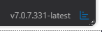

# AlphaVector ATAS Indicators
This repository contains a collection of custom indicators for the ATAS platform.

## Indicators Overview
### DailyLines Extended
Extends the standard Daily Lines Indicator with POC (Point of Control), VAH (Value Area High), VAL (Value Area Low) and
configurable alerts. Helps traders identify key price levels from previous trading periods and be alerted when these 
levels are breached.

### Charting Hotkeys
Provides keyboard shortcuts to quickly switch between different footprint chart layouts. Includes configurable visual
modes, content modes, and color schemes that can be cycled through with hotkeys.

### Opening Range
Displays the high and low range of market opening periods with configurable timeframes (daily/weekly). Features
customizable appearance, formation markers, and price alerts when levels are breached.

### Ratios Extended
Extends the standard Ratios Indicator with configurable appearance. Useful for analyzing exhaustion and absorption 
levels at the top and bottom of footprints.

### SessionColor Extended
Extends the Standard SessionColor Indicator with more visual settings. Colors different trading sessions on the chart 
with customizable appearance. Includes start/end session alerts and various display options to highlight specific 
trading periods.

### TimeFrame Marker
Displays vertical lines at significant time boundaries (day, week, or month), providing visual reference points for
different timeframes directly on the chart.

## Setup and Installation
### Prerequisites
- Visual Studio 2019 or later
- .NET 8.0 SDK
- ATAS Platform installed

### Building the Solution
1. Clone this repository to your local machine.

   `git clone https://github.com/alpha-vector-trade/atas-indicators.git`

2. Open AtasIndicators.sln in Visual Studio.
3. Restore NuGet packages for the solution:

   `nuget restore AtasIndicators.sln`

4. The default ATAS installation paths are already configured in the project files:

   - ATAS Platform: `C:\Program Files (x86)\ATAS Platform`
   - ATAS User Indicators: `%USERPROFILE%\Documents\ATAS\Indicators`
   
   If your ATAS is installed in a different location, update the paths in each project file.

## Installation Details
Each project contains a post-build event that:

- Uses ILRepack to merge the compiled DLL with required dependencies
- Copies the resulting DLL to your ATAS indicators folder

## Loading Indicators in ATAS
After building the indicators launch the ATAS Platform.

If ATAS was already running during compilation:

Find the the icon with the three little blue stripes in the bottom right corner of the ATAS main window. Click on it
and the indicators should reload automatically.

## Troubleshooting
If indicators don't appear in ATAS after building:

- Ensure you have proper write permissions to the ATAS Indicators folder
- Verify the post-build events executed successfully (check Output window in Visual Studio)
- Make sure the indicator DLLs are actually in your ATAS Indicators folder 

If you get dependency errors:

- Ensure your ATAS Platform installation path is correctly set in the project files
- Check if all required ATAS DLLs are available in the referenced path
